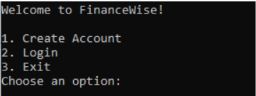
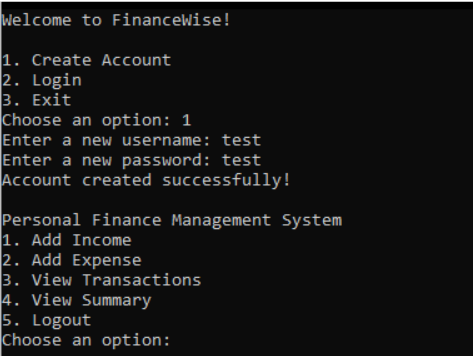
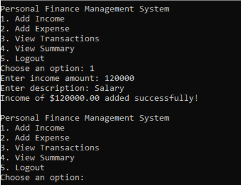
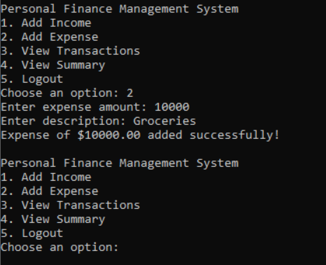
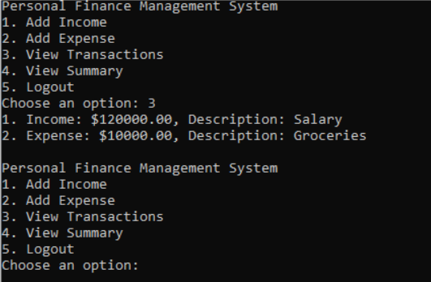
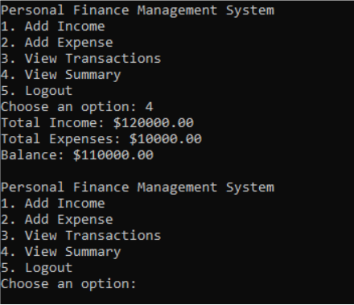
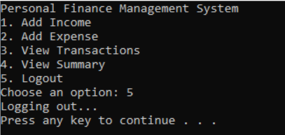

# FinanceWise: Personal Finance Management System

---

## Table of Contents

1. [Project Overview](#project-overview)
2. [Explanation of How Python Concepts, Libraries, etc. Were Applied](#explanation-of-how-python-concepts-libraries-etc-were-applied)
   - [Object-Oriented Programming (OOP)](#object-oriented-programming-oop)
   - [Data Storage Using JSON](#data-storage-using-json)
   - [Error Handling](#error-handling)
   - [Dynamic File Handling Using OS Library](#dynamic-file-handling-using-os-library)
   - [User Experience Enhancements](#user-experience-enhancements)
   - [Iterative Input](#iterative-input)
3. [Details of the Chosen SDG and Its Integration into the Project](#details-of-the-chosen-sdg-and-its-integration-into-the-project)
4. [Instructions for Running the Program](#instructions-for-running-the-program)

---

## I. Project Overview

**FinanceWise** is a personal finance management system designed to help users track their income, expenses, and total cash flow. With a straightforward graphical user interface (GUI), the system simplifies financial management, making it easy to understand and utilize. This project serves as a practical tool for securely and efficiently managing personal finances.

---

## II. Explanation of How Python Concepts, Libraries, etc. Were Applied

The **FinanceWise: Personal Finance Management System** was designed using key programming principles and Python's standard libraries to achieve modularity, efficiency, and reliability. Below is an academic analysis of how various Python concepts and libraries were applied:

### Object-Oriented Programming (OOP):

1.1. **Encapsulation**: The project utilizes a class, `PersonalFinanceManager`, to encapsulate all functionalities related to managing finances. Methods within this class, such as `add_transaction`, `view_transactions`, and `get_summary`, handle specific tasks, keeping the logic organized.

1.2. **Abstraction**: Hides internal complexities like file handling, offering clean methods for tasks like adding and viewing transactions. This improves the user experience and system usability.

### Data Storage Using JSON:

2.1. **JSON** library was implemented to handle persistent data storage without relying on external databases. Transactions and user account data are saved in separate JSON files (`transactions.json` and `accounts.json`), ensuring that all data is retained between sessions.

2.2. **JSON’s** structured format allows efficient parsing and writing of nested data, making it an ideal lightweight solution for storing structured records like user accounts and transactions.

### Error Handling:

3.1. **Input Validation**: Checks ensure that invalid inputs, such as non-numeric transaction amounts, are handled carefully.

3.2. **File Operations**: Exception handling is used to manage file operations. For instance, the program checks for the existence of required files before reading data and creates them automatically if missing, preventing errors.

### Dynamic File Handling Using OS Library:

4.1. The **os** library ensures a seamless interaction with the file system. For example, the `os.path.exists()` function checks if data files exist, enabling the program to handle scenarios where these files are missing by initializing them with default values.

### User Experience Enhancements:

5.1. A personalized welcome message, displayed after user authentication, adds a friendly touch to the system. This feature uses the user’s name to create a more engaging and friendly interface.

5.2. Organized menus and clear prompts for users to navigate the system easily.

### Iterative Input:

6.1. Infinite input loops ensure that the program repeatedly prompts users for valid credentials or options. This design prevents the program from terminating abruptly due to invalid user actions.

---

## III. Details of the Chosen SDG and Its Integration into the Project

The **FinanceWise: Personal Finance Management System** aligns with **Sustainable Development Goal (SDG) 8**, which focuses on promoting sustained, inclusive economic growth and decent work for all. By giving users an easy-to-use yet powerful tool for managing their money, the system promotes financial awareness and discipline, which are the foundations of personal financial stability and growth.

With **FinanceWise**, users can keep track of their income and expenses and gain a better understanding of their financial situation. Better financial decision-making is encouraged by this feature, which lowers impulsive spending and increases savings. By giving people these resources, the system assists users in becoming financially independent, which is a prerequisite for equitable and long-term economic growth.

---

## IV. Instructions for Running the Program

### Login or Create Account:

- **New Users**:  
  Choose the "Create Account" option and set up your username and password.
  

- **Returning Users**:  
  Log in with your existing credentials.
  

---

### Welcome Message:
- **For Returning Users**:  
  Upon logging in, you will be greeted with a welcome message displaying your name and account status.  

- **For New Users**:  
  After creating an account, you will be welcomed and directed to the main menu.

---

### Navigate the Main Menu:
1. **Add Income**:  
   - Record an income amount and provide a description (e.g., "Salary").  
   - The system will save the entry for future reference.   

2. **Add Expense**:  
   - Log expenses by specifying the amount and a description (e.g., "Groceries").  

3. **View Transactions**:  
   - Displays a numbered list of all recorded incomes and expenses.

4. **View Summary**:  
   - Shows your total income, total expenses, and remaining balance, providing a clear snapshot of your finances.

5. **Exit**:  
   - When done, choose the "Logout" option to close the program.  
   - All data will be saved automatically for the next session.  

---

